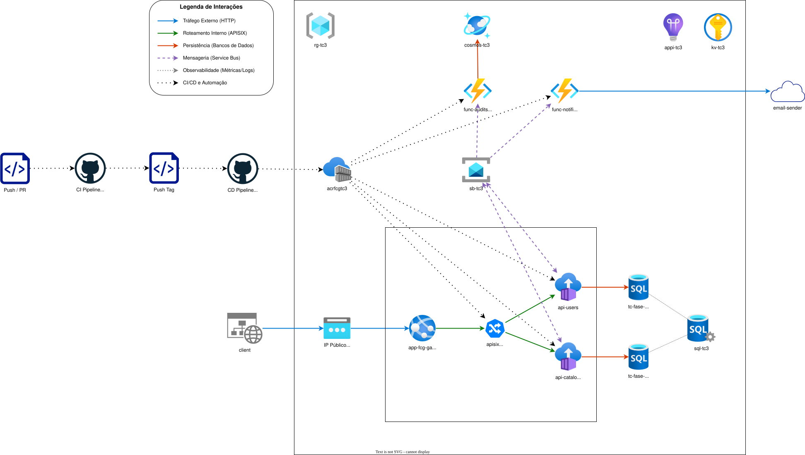
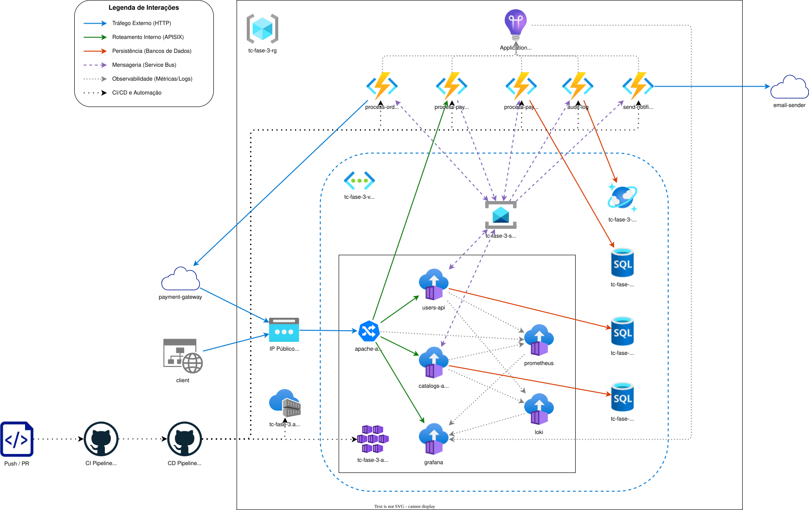
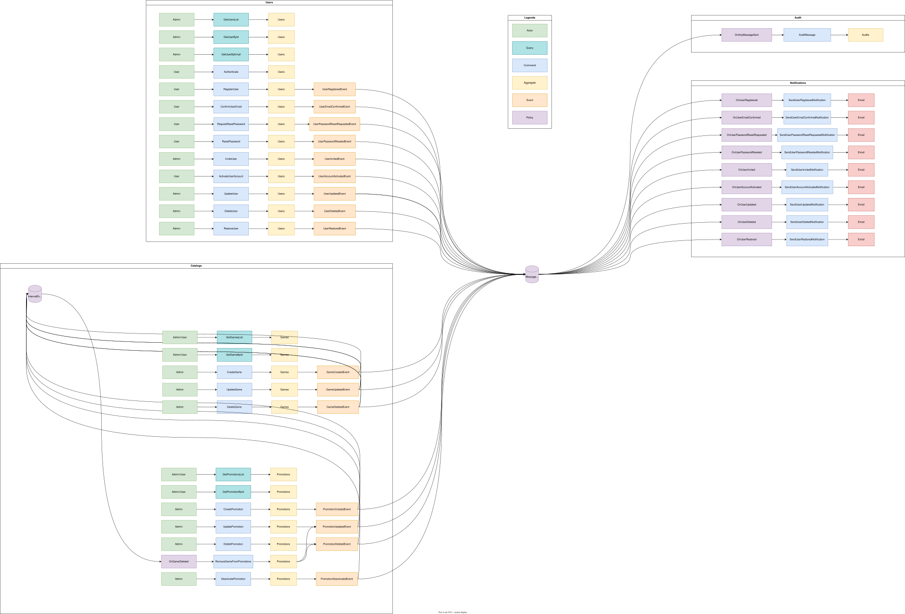
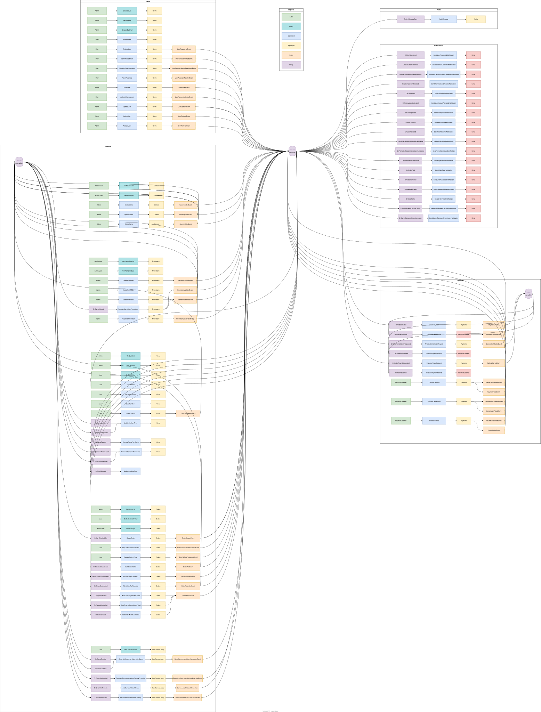

<h1>Tech Challenge - FIAP Cloud Games - 10NETT - Grupo 29 - Fase 3</h1>

<h2>Sobre o Projeto</h2>

Evolução do sistema FCG em microsserviços rodando localmente via Docker Compose e Kubernetes (Fase 2) para uma arquitetura serverless na nuvem.

Como provedor de nuvem, utilizamos a Microsoft Azure, aproveitando serviços como Azure Functions, Azure Cosmos DB, Azure Service Bus e Azure Key Vault para criar uma aplicação escalável, resiliente e orientada a eventos.

---

<h2>Serviços</h2>

|Projeto|Tipo|Repositório|Responsabilidade|
|---|---|---|---|
|Users|API|[cloud-games-fase-3-users](https://github.com/reneesalles/cloud-games-fase-3-users)|Gerenciamento de usuários, autenticação e autorização.|
|Catalog|API|[cloud-games-fase-3-catalog](https://github.com/reneesalles/cloud-games-fase-3-catalog)|Gerenciamento do catálogo de jogos, promoções, biblioteca e carrinho do usuário, e checkout.|
|Notifications|Azure Functions|[cloud-games-fase-3-notifications](https://github.com/reneesalles/cloud-games-fase-3-notifications)|Gerenciamento de notificações para os usuários, como promoções, atualizações de jogos, cadastro do usuário, status dos pedidos.|
|Payments|Azure Functions|[cloud-games-fase-3-payments](https://github.com/reneesalles/cloud-games-fase-3-payments)|Gerenciamento de pagamentos, integração com gateways de pagamento, processamento de transações e status dos pedidos.|
|Audit|Azure Functions|[cloud-games-fase-3-audit](https://github.com/reneesalles/cloud-games-fase-3-audit)|Gerenciamento de auditoria, registro de eventos e atividades do sistema para monitoramento e análise.|

---

<h2>Documentos</h2>

- [Instruções TC Fase 3](./docs/TC-NETT-FASE-3.md): documento oficial do desafio, contendo os requisitos e critérios de avaliação.
- [ARQUITETURA-CLOUD.current.drawio](./docs/ARQUITETURA-CLOUD.current.drawio): diagrama da arquitetura real do projeto, conforme efetivamente provisionado na Azure.
    
- [ARQUITETURA-CLOUD.target.drawio](./docs/ARQUITETURA-CLOUD.target.drawio): diagrama da arquitetura idealizada no início do projeto, contendo recursos que não chegaram a ser implementados.
    
- [EVENTOS.current.drawio](./docs/EVENTOS.current.drawio): diagrama do mapeamento real dos eventos publicados e consumidos entre os serviços.
    
- [EVENTOS.target.drawio](./docs/EVENTOS.target.drawio): diagrama do mapeamento idealizado dos eventos, contendo fluxos e eventos que não chegaram a ser implementados.
    

---

<h2>Arquitetura Cloud</h2>

A arquitetura cloud do sistema FCG é baseada em microsserviços na Azure, combinando APIs containerizadas e Azure Functions orientadas a eventos.

<h3>Gateway e Hospedagem</h3>

O tráfego externo entra via IP público (Load Balancer) e é encaminhado ao **Azure App Service** (`app-fcg-gateway`), que hospeda o **APISIX** como API Gateway. O APISIX é responsável por rotear as requisições para as APIs de **Users** e **Catalog**, rodando como containers dentro do mesmo App Service, além de expor a documentação com autenticação básica.

| Rota | URIs | Upstream | Rate Limit | Basic Auth |
|---|---|---|---|---|
| `users-docs-route` | `/api/users/openapi/*`<br>`/api/users/scalar`<br>`/api/users/scalar/*` | `api-users:8080` | ✗ | ✔ `DOCS_USERNAME` / `DOCS_PASSWORD` |
| `users-cloud-routes` | `/api/users`<br>`/api/users/*` | `api-users:8080` | ✔ 5 req/s, burst 2, HTTP 429 | ✗ |
| `catalogs-docs-route` | `/api/catalogs/openapi/*`<br>`/api/catalogs/scalar`<br>`/api/catalogs/scalar/*` | `api-catalogs:8080` | ✗ | ✔ `DOCS_USERNAME` / `DOCS_PASSWORD` |
| `catalogs-cloud-routes` | `/api/catalogs`<br>`/api/catalogs/*` | `api-catalogs:8080` | ✔ 20 req/s, burst 10, HTTP 429 | ✗ |

> As rotas de documentação têm `priority: 10`, garantindo que o APISIX as avalie antes das rotas genéricas de cada serviço. O rate limit é aplicado por IP (`remote_addr`).

<h3>Mensageria e Eventos</h3>

A comunicação assíncrona entre serviços é feita via **Azure Service Bus** (`sb-tc3`), organizado em quatro tópicos com suas respectivas assinaturas:

| Tópico | Assinante | Eventos recebidos |
|---|---|---|
| `integration-events` | `audit-log-subscription` | Todos (`*`) |
| `user-events` | `catalog-subscription` | `user-updated` |
| `user-events` | `notification-subscription` | Registro, confirmação, redefinição de senha, convite, ativação, atualização, exclusão e restauração de usuário |
| `catalog-events` | `payment-subscription` | Criação, cancelamento e reembolso de pedidos |
| `catalog-events` | `notification-subscription` | Recomendações, status de pedidos, alterações na biblioteca |
| `payment-events` | `catalog-subscription` | Sucesso/falha de pagamento, cancelamento e reembolso |
| `payment-events` | `notification-subscription` | Link de pagamento gerado |

<h3>Azure Functions (Serverless)</h3>

Os serviços de **Audit**, **Notifications** e **Payments** são implementados como Azure Functions, acionadas pelas assinaturas do Service Bus. As imagens são armazenadas no **Azure Container Registry** (`acrfcg`) e implantadas via CI/CD do GitHub Actions.

<h3>Persistência</h3>

- **Azure SQL Database** (`sql-tc3`): três bancos relacionais dedicados — `tc-fase-3-users-db`, `tc-fase-3-catalogs-db` e `tc-fase-3-payments-db`.
- **Azure Cosmos DB** (`cosmos-tc3`, serverless): armazena os logs de auditoria no container `AuditLogs`, particionado por `/AggregateId`.

<h3>Segurança e Observabilidade</h3>

Todos os segredos (connection strings, chaves JWT, credenciais de admin) são armazenados no **Azure Key Vault** (`kv-tc3`) e referenciados via Key Vault References nas configurações das Functions e do App Service. O monitoramento é centralizado no **Application Insights** (`appi-tc3`), integrado a um **Log Analytics Workspace** (`log-tc3`).

<h3>CI/CD</h3>

O pipeline de CI (GitHub Actions) executa testes e validações a cada push. Na publicação de uma tag, o pipeline de CD constrói as imagens Docker, as envia ao ACR e dispara o redeploy automático via webhook no App Service e nas Azure Functions. As credenciais de acesso ao Azure são geradas pelo próprio script `orchestration.ps1` ao final da execução.

---

<h2>Scripts úteis</h2>

<h3>Criar estrutura de projetos .NET com Clean Architecture</h3>

<sub>[create-project-clean-arch.ps1](./scripts/create-project-clean-arch.ps1)</sub>

O script `create-project-clean-arch.ps1` tem a função de criar a estrutura de projetos .NET com Clean Architecture para os serviços de `Users` e `Catalog`, além de um projeto de Azure Functions para cada um dos serviços (`Audit`, `Notifications`, `Payments`), e um projeto de testes unitários.

Para executar o script, navegue até a pasta do script e rode o comando abaixo no terminal PowerShell:

```powershell
cd scripts
.\create-project-clean-arch.ps1
```

> [!Tip]
> Você pode ajustar as opções de criação dos projetos editando o script, como adicionar ou remover a criação de APIs, Functions e testes, além de configurar os namespaces e referências entre os projetos.

<h3>Subir e configurar recursos do Azure</h3>

<sub>[orchestration.ps1](./scripts/azure-cli/orchestration.ps1)</sub>

O script `orchestration.ps1` tem a função de criar e configurar os recursos necessários no Azure para rodar as Azure Functions, como Azure Cosmos DB, SQL Server, Azure Service Bus, Azure Key Vault, e gerar as credenciais necessárias para configurar os segredos no GitHub Actions.

Para executar o script, navegue até a pasta do script e rode o comando abaixo no terminal PowerShell:

```powershell
cd scripts/azure-cli
.\orchestration.ps1
```

> [!Tip]
> Certifique-se de estar autenticado no Azure CLI antes de executar o script:
> ```powershell
> az login
> ```
> Ao término do script, será gerado um arquivo `github-credentials.json` com as credenciais do Azure para configurar os segredos no GitHub Actions.

> [!Warning] 
> Certifique-se de criar/ajustar no arquivo `.env` as variáveis de ambiente no script conforme necessário antes de executá-lo.\
> Utilize o arquivo `.env.example` como referência para criar o arquivo `.env` com as variáveis de ambiente necessárias para a execução do script.

| Variável | Descrição | Exemplo |
|---|---|---|
| `env` | Ambiente de execução | `dev` |
| `location` | Região principal dos recursos Azure | `westus2` |
| `sqlLocation` | Região para o Azure SQL (pode diferir da principal) | `westus2` |
| `appServiceLocation` | Região para o App Service (pode diferir da principal) | `eastus` |
| `suffix` | Sufixo único e curto para nomear recursos (máx. ~18 chars para o Key Vault) | `tc3-nett-v3` |
| `suffixTrimmed` | Sufixo sem hífens, usado no Azure Container Registry | `tc3nettv3` |
| `sqlAdmin` | Usuário administrador do Azure SQL | `tcadmin` |
| `sqlPassword` | Senha do administrador do Azure SQL | `P@ssw0rdTechChallenge3!` |
| `cosmosDbName` | Nome do banco de dados no Cosmos DB | `CloudGamesAuditDb` |
| `cosmosContainerName` | Nome do container no Cosmos DB | `AuditLogs` |
| `cosmosPartitionKey` | Chave de partição do container Cosmos DB | `/AggregateId` |
| `jwtSecret` | Chave secreta para geração de tokens JWT | `sua-chave-secreta-aqui-para-jwt` |
| `jwtIssuer` | Emissor do token JWT | `Fiap.CloudGames.Dev` |
| `jwtExpiryMinutes` | Tempo de expiração do token JWT em minutos | `60` |
| `jwtAudience` | Audiência do token JWT | `Fiap.CloudGames.Dev` |
| `adminUserPassword` | Senha do usuário administrador padrão | `StrongP@ssw0rd!` |
| `adminUserName` | Nome do usuário administrador padrão | `Administrador` |
| `adminUserEmail` | E-mail do usuário administrador padrão | `admin@email.com` |
| `docsUsername` | Usuário para acesso à documentação (APISIX) | `admin` |
| `docsPassword` | Senha para acesso à documentação (APISIX) | `StrongP@ssw0rd!` |

<h3>Gerar configuração para Azure Functions</h3>

<sub>[config-functions.ps1](./scripts/azure-cli/config-functions.ps1)</sub>

O script `config-functions.ps1` tem a função de gerar um json com as variáveis de ambiente necessárias para rodar as Azure Functions localmente, utilizando as variáveis de ambiente definidas no script.

Para executar o script, navegue até a pasta do script e rode o comando abaixo no terminal PowerShell:

```powershell
cd scripts/azure-cli
.\config-functions.ps1
```

> [!Tip]
> Ao término do script, gera um json para colar no arquivo `local.settings.json` para rodar as Azure Functions localmente, utilizando as variáveis de ambiente definidas no script.\

> [!Warning]
> Certifique-se de ter executado o script de infraestrutura para criar os recursos no Azure e ter as variáveis de ambiente definidas corretamente antes de executar este script.

<h3>Atualizar configuração do APISIX</h3>

<sub>[update-apisix-docker.ps1](./scripts/azure-cli/update-apisix-docker.ps1)</sub>

O script `update-apisix-docker.ps1` tem a função de atualizar os arquivos de configuração do APISIX na pasta `apisix_conf` (arquivos `apisix.yaml` e `config.yaml`) para poder enviá-los para o Azure Container Registry.
- O arquivo `apisix.yaml` possui as configurações de rotas, upstreams, plugins e consumidores do APISIX, utilizando as variáveis de ambiente definidas no script para configurar as rotas e plugins de autenticação e rate limit.
- O arquivo `config.yaml` possui as configurações de cluster e administração do APISIX, utilizando as variáveis de ambiente definidas no script para configurar o acesso ao Azure Key Vault e ao Azure Service Bus.

Para executar o script, navegue até a pasta do script e rode o comando abaixo no terminal PowerShell:

```powershell
cd scripts/azure-cli
.\update-apisix-docker.ps1
```

> [!Warning]
> Certifique-se de ter executado o script de infraestrutura para criar os recursos no Azure e ter as variáveis de ambiente definidas corretamente antes de executar este script.\
> Também certifique-se de ter o Docker Desktop rodando para que o script possa atualizar a configuração do APISIX localmente.

<h3>Atualizar docker-compose no Application Service</h3>

<sub>[deploy-container.ps1](./scripts/azure-cli/deploy-container.ps1)</sub>

O script `deploy-container.ps1` tem a função de atualizar o docker-compose do Application Service com as imagens do APISIX, serviços de Users e Catalog, e as variáveis de ambiente necessárias para rodar a aplicação.

Para executar o script, navegue até a pasta do script e rode o comando abaixo no terminal PowerShell:

```powershell
cd scripts/azure-cli
.\deploy-container.ps1
```

> [!Warning]
> Certifique-se de ter executado o script de infraestrutura para criar os recursos no Azure e ter as variáveis de ambiente definidas corretamente antes de executar este script.

<h3>Limpar recursos do Azure</h3>

<sub>[kill.ps1](./scripts/azure-cli/kill.ps1)</sub>

O script `kill.ps1` tem a função de remover os recursos criados no Azure no Resource Group configurado no arquivo `.env`.

Para executar o script, navegue até a pasta do script e rode o comando abaixo no terminal PowerShell:

```powershell
cd scripts/azure-cli
.\kill.ps1
```

> [!Warning]
> Certifique-se de criar/ajustar no arquivo `.env` as variáveis de ambiente no script conforme necessário antes de executá-lo.
